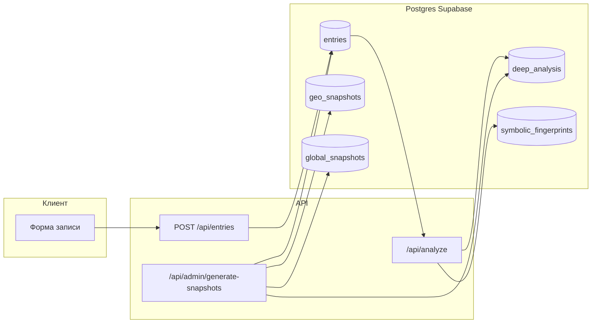

# CASSANDRA — поток данных (обзор)

Краткая схема того, как информация проходит через систему: от записи пользователя до агрегатов и админки.

## 1. Пользователь → запись

1. **UI** (`InlineEntryForm` и др.) отправляет `POST /api/entries` с текстом сигнала.
2. **Supabase** сохраняет строку в `entries` (контент, пользователь, при необходимости IP → `ip_country_code` и др.).
3. Если включён анализ и успевает синхронный вызов Claude, **`applyClaudeAnalysisToEntry`** обновляет поля записи (тип, образы, тревожность и т.д.).
4. После сохранения может вызываться **отложенный анализ** (`/api/analyze` с `entryIds` через cron или очередь), если синхронный проход не заполнил `ai_analyzed_at`.

## 2. Анализ (AI)

1. **`/api/analyze`** (cron / `CRON_SECRET`) вызывает **`runAnalysis`** или **`runAnalysisForEntryIds`** (`src/lib/analysis/index.ts`).
2. Для каждой необработанной записи вызывается **`analyzeEntry`** (Claude), затем **`processOneEntry`** — запись в БД, включая **`postAnalysis` → `syncDeepAnalysisFromPrimary`** → таблица **`deep_analysis`** (архетипы, эмоции, символические элементы).
3. **`updateFingerprint`** обновляет **`symbolic_fingerprints`** для пользователя (индивидуальный «снимок»).

## 3. Цепочка после анализа (cron `/api/cron`)

Оркестратор последовательно дергает, среди прочего:

- **`/api/verify`** — сверка с событиями, матчи.
- **`/api/coherence`**, **`/api/cluster`**, **`/api/recalculate-scores`** — когерентность, кластеры, скоринг.
- **`/api/reality-snapshot`** — снимок «реальности» в **`reality_snapshots`**.
- Параллельно: **`/api/cluster`**, и т.д.

**`POST /api/admin/generate-snapshots`** (тот же `CRON_SECRET`) вызывается из оркестратора **`/api/cron`** раз в сутки — на **Vercel Hobby** разрешён только один cron job в день, отдельное расписание каждые 6 часов недоступно. На **Pro** при желании можно вынести снимки в отдельный cron с более частым графиком. Агрегация: **`deep_analysis`** + **`entries`** → **`geo_snapshots`**, при условиях → **`global_snapshots`** (не чаще одной строки на календарный день).

## 4. Где что хранится (кратко)

| Таблица | Назначение |
|--------|------------|
| `entries` | Исходный сигнал, результаты первого прохода AI, гео/IP, тревожность |
| `deep_analysis` | «Глубинный» слой по записи (эмоции, архетипы, символы) |
| `symbolic_fingerprints` | Агрегат по пользователю (снимок психики, траектории) |
| `geo_snapshots` / `global_snapshots` | Коллективные снимки по странам и глобально (cron) |
| `reality_snapshots` | Агрегат коллектива (отдельный пайплайн) |
| `system_settings` | Фичи, research portal и др. |

## 5. Админка и API

- **`GET /api/admin/psyche-data`** — данные для `/admin/psyche` (роль architect/admin).
- Остальные **`/api/admin/*`** — пользователи, записи, настройки, аудит (через service role + проверка роли).

## Диаграмма (упрощённо)

**Выводы в системе** строятся не одной моделью, а цепочкой: извлечение признаков (Claude) → сохранение в `entries` / `deep_analysis` → агрегаты (fingerprint, geo/global snapshots) → при необходимости верификация и матчи. Социально-политические «вероятности» в geo-снимках — эвристика поверх агрегированных эмоций и архетипов (`calculateSocialForecast`), а не предсказание конкретных событий.
