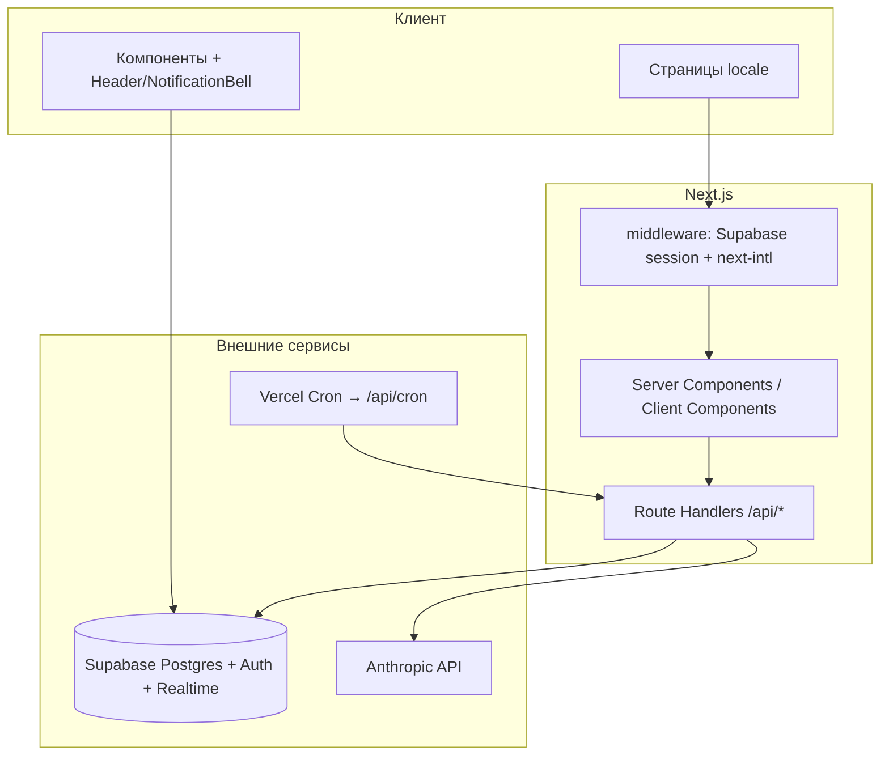

# Архитектура слоёв

## Продукт

**CASSANDRA** — платформа коллективных предвестий: пользователи публикуют сны/предчувствия, ИИ извлекает признаки, система сопоставляет с событиями реального мира; подтверждённые совпадения влияют на рейтинг и роль.

## Технологический стек

| Слой | Технология |
|------|------------|
| UI | Next.js 14 **App Router**, React 18, **Tailwind CSS** |
| Язык | **TypeScript** (`strict`) |
| i18n | **next-intl** (`ru`, `en`), сообщения в `messages/ru.json`, `messages/en.json` |
| Backend данных | **Supabase** (Postgres, Auth, RLS, Realtime, Storage) |
| ИИ | **Anthropic Claude** (`@anthropic-ai/sdk`) |
| Визуализация | `react-simple-maps`, `d3-scale`, **recharts** (админ Psyche) |
| Даты | `date-fns` |
| Хостинг | **Vercel**; cron через `vercel.json` |

## Логические слои (единая система)

### Связность

- **Один фронтенд-код** обслуживает публичные и админ-маршруты под `[locale]`.
- **Один бэкенд-контур** — HTTP API в `src/app/api`; нет отдельного микросервиса приложения.
- **Фоновые задачи** не используют отдельную очередь: оркестрация через **один дневной cron** (`/api/cron`), который последовательно и параллельно вызывает другие endpoint’ы с `Authorization: Bearer CRON_SECRET` (см. [03-data-flow-and-pipeline.md](./03-data-flow-and-pipeline.md)).

### Навигация и локаль

- Внутренние ссылки из клиентских компонентов: **`@/navigation`** (`Link`, `useRouter`), не `next/navigation` для страниц приложения.
- Файл: `src/navigation.ts`.

### Ключевые директории

| Путь | Назначение |
|------|------------|
| `src/app/[locale]/` | UI страниц (группы `(main)`, `(admin)`, `(auth)`, `(legal)`) |
| `src/app/api/` | REST-подобные route handlers |
| `src/lib/` | Бизнес-логика: `analysis`, `verification`, `scientific`, `engagement`, Supabase-клиенты |
| `src/components/` | Переиспользуемый UI, в т.ч. `layout/Header`, `NotificationBell` |
| `supabase/migrations/` | Схема БД, версионируемая миграциями |
| `messages/` | Строки i18n |
